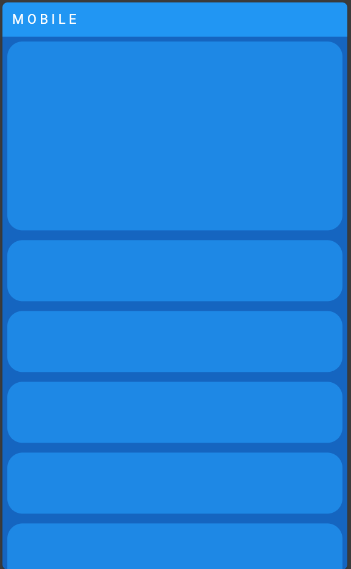

# responsivetemplate
 flutter template for responsive design

 This is temple from which one might achieve effective responsiveness in flutter application.This is the minimal approcah that puts minimal load into the UI for processing the responsiveness.

    Mobile View
 

    Desktop View

 

 Note: This is just an example to show how one might achieve reponsiveness into flutter applications. Their might be even better approach to have a reponsiveness in flutter applications
